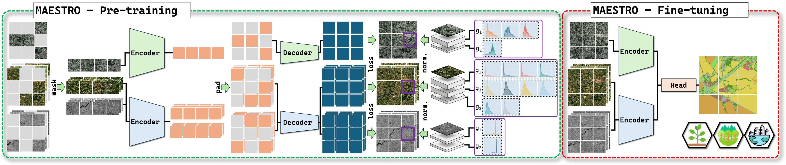

<h1 align="center"> MAESTRO: Masked Autoencoders for Multimodal, Multitemporal, and Multispectral Earth Observation Data <a href="https://arxiv.org/abs/2508.10894">"></a></h1>
<h4 align="center">Official implementation for <a href="https://arxiv.org/abs/2508.10894">Masked Autoencoders for Multimodal, Multitemporal, and Multispectral Earth Observation Data</a></h4>
<p align="center">
  <a href="#abstract">Abstract</a> |
  <a href="#%EF%B8%8F-pre-trained-models">Pre-trained Models</a> |
  <a href="#datasets">Datasets</a> |
  <a href="#intra-dataset-evaluation">Results</a> |
  <a href="#-getting-started">Getting Started</a>
</p>


## 📰 Update

- **[2026-01]** 🚀 **Pre-trained MAESTRO models released on HuggingFace**
  - [MAESTRO_FLAIR-HUB_base](https://huggingface.co/IGNF/MAESTRO_FLAIR-HUB_base) — pre-trained on FLAIR-HUB
  - [MAESTRO_S2-NAIP-urban_base](https://huggingface.co/IGNF/MAESTRO_S2-NAIP-urban_base) — pre-trained on S2-NAIP-urban

- **[2025-11]** 🎓 **MAESTRO accepted at WACV 2026**


## Abstract

**MAESTRO** is a tailored adaptation of the Masked Autoencoder (MAE) that effectively orchestrates the use of multimodal, multitemporal, and multispectral Earth Observation (EO) data. Evaluated on four EO datasets, MAESTRO sets a new state-of-the-art on tasks that strongly rely on multitemporal dynamics, while remaining competitive on tasks dominated by a single monotemporal modality.

MAESTRO's contributions are as follows:
- **Extensive benchmarking of multimodal and multitemporal SSL:** Impact evaluation of various fusion strategies for multimodal and multitemporal SSL.
- **Patch-group-wise normalization:** Novel normalization scheme that normalizes reconstruction targets patch-wise within groups of highly correlated spectral bands.
- **MAESTRO:** Novel adaptation of the MAE that combines optimized fusion strategies with patch-group-wise normalization.

<p align="center">
  <br>
  <em>Figure 1 — MAESTRO overview.</em>
</p>


## Datasets
Our implementation already supports 5 datasets.

**[TreeSatAI-TS](https://huggingface.co/datasets/IGNF/TreeSatAI-Time-Series)** <br />
Tree species identification in Germany, with 15 multi-label classes.
  - Extent: 50,381 tiles of 60 × 60 m, covering 181 km².
  - Modalities: aerial imagery RGB + NIR (0.2 m), Sentinel-1 time series, Sentinel-2 time series.
  - [Dataset split](https://huggingface.co/IGNF/MAESTRO_FLAIR-HUB_base/tree/main/dataset_splits/TreeSatAI-TS)

**[PASTIS-HD](https://huggingface.co/datasets/IGNF/PASTIS-HD)** <br/>
Agricultural crop segmentation in France, with 19 semantic classes.
  - Extent: 433 tiles of 1280 × 1280 m, covering 709 km².
  - Modalities: VHR satellite imagery SPOT 6-7 (1 m), Sentinel-1 time series, Sentinel-2 time series.
  - [Dataset split](https://huggingface.co/IGNF/MAESTRO_FLAIR-HUB_base/tree/main/dataset_splits/PASTIS-HD)

**[FLAIR#2](https://arxiv.org/abs/2305.14467)** <br/>
Land cover segmentation in France, with 12 semantic classes. Note that the FLAIR#2 version used here is not the original release, but a regenerated version obtained by refiltering FLAIR-HUB.
  - Extent: 77,762 tiles of 102.4 × 102.4 m, covering 815 km².
  - Modalities: Aerial and elevation imagery RGB + NIR + DEM + DSM (0.2 m), Sentinel-2 time series.
  - [Dataset split](https://huggingface.co/IGNF/MAESTRO_FLAIR-HUB_base/tree/main/dataset_splits/FLAIR-HUB)

**[FLAIR-HUB](https://huggingface.co/datasets/IGNF/FLAIR-HUB)** <br/>
Land cover segmentation in France, with 15 semantic classes.
  - Extent: 241,100 tiles of 102.4 × 102.4 m, covering 2,528 km².
  - Modalities: Aerial and elevation imagery RGB + NIR + DEM +
DSM (0.2 m), Sentinel-1 time series, Sentinel-2 time series.
  - [Dataset split](https://huggingface.co/IGNF/MAESTRO_FLAIR-HUB_base/tree/main/dataset_splits/FLAIR-HUB)

**[S2-NAIP urban](https://huggingface.co/datasets/allenai/s2-naip)** <br/>
Super-resolution in urban areas of the United States. To construct this urban subset, the original S2-NAIP footprints are intersected with the urban set defined in [Zooming-in zooming-out](https://github.com/allenai/satlas-super-resolution), which is limited to locations within a 5 km radius of U.S. cities with populations of at least 50,000.
  - Extent: 167,397 tiles of size 640 m × 640 m, covering 68,565 km².
  - Modalities: Aerial NAIP imagery RGB + NIR (1.25 m), Sentinel-1 time series, Sentinel-2 time series.
  - [Dataset split](https://huggingface.co/IGNF/MAESTRO_FLAIR-HUB_base/tree/main/dataset_splits/s2-naip-urban)


## Intra-dataset Evaluation

<p align="center">
  <em>
    Table 1 — Intra-dataset evaluation of MAESTRO, supervised ViTs, and previous SOTA.<br>
    We report wF1 (%) on TreeSatAI-TS and mIoU (%) on PASTIS-HD, FLAIR#2, and FLAIR-HUB.<br>
    MAESTRO† models are pre-trained for twice the number of epochs.
  </em>

| Model              | TreeSatAI-TS | PASTIS-HD | FLAIR#2 | FLAIR-HUB |
|--------------------|--------------|-----------|---------|-----------|
| MAESTRO  (ours)    | 78.8         | 68.6      | 62.6    | **65.9** 🟢↑**1.6**|
| MAESTRO† (ours)    | **79.4** 🟢↑**3.8** | **69.0** 🟢↑**2.5** | 63.3 🔴↓**0.8**| 65.8 |
| ViT                | 75.6         | 64.5      | 58.2    | 62.1      |
| Previous SOTA      | 75.1         | 66.5      | **64.1**    | 64.3      |
</p>


## Cross-dataset Evaluation

<p align="center">
  <em>
    Table 2 — Cross-dataset evaluation of MAESTRO and adapted baseline FMs. The baseline FMs are adapted to handle an arbitrary number of dates and/or to retain all modality bands. <br>
    We report wF1 (%) on TreeSatAI-TS and mIoU (%) on PASTIS-HD, FLAIR#2, and FLAIR-HUB.<br>
  </em>

| Model              | Pre-training dataset | TreeSatAI-TS | PASTIS-HD | FLAIR#2 | FLAIR-HUB |
|--------------------|-----------------------|--------------|-----------|---------|-----------|
| MAESTRO (ours)     | FLAIR-HUB             | **79.6**     | **68.0**  | -       | -         |
| MAESTRO (ours)     | S2-NAIP urban         | 78.8         | 67.4      | 62.6    | 64.6      |
| DINO-v2            | LVD-142M              | 76.7         | 64.4      | **64.2**| 66.0      |
| DINO-v2 sat.       | Maxar Vivid2          | 76.3         | 64.0      | 63.5    | **66.0**  |
| DOFA               | DOFA MM               | 76.0         | 62.9      | 62.3    | 65.1      |
| CROMA              | SSL4EO                | 70.5         | 65.0      | 39.0    | 44.3      |
| Prithvi-EO-2.0     | HLS                   | 75.6         | 66.2      | 41.8    | 44.9      |
| SatMAE             | fMoW RGB+S            | 76.9         | 66.6      | 42.5    | 45.0      |
</p>


## 🚀 Getting Started

The module is setup with [Poetry](https://python-poetry.org/):

```bash
# 1. Change directory
cd MAESTRO

# 2. Install dependencies with Poetry
poetry install
```

### Starting from Pre-trained Models

Prerequisites:
- Fetch [Dataset splits](dataset_splits) and move them to each dataset directory
- Fetch model weights and configuration as detailed in the models cards for [MAESTRO_FLAIR-HUB_base](https://huggingface.co/IGNF/MAESTRO_FLAIR-HUB_base) and [MAESTRO_S2-NAIP-urban_base](https://huggingface.co/IGNF/MAESTRO_S2-NAIP-urban_base).

Then you can start from the example commands provided on the models cards for [MAESTRO_FLAIR-HUB_base](https://huggingface.co/IGNF/MAESTRO_FLAIR-HUB_base) and [MAESTRO_S2-NAIP-urban_base](https://huggingface.co/IGNF/MAESTRO_S2-NAIP-urban_base).


### Starting from Scratch

Prerequisites:
- Fetch [Dataset splits](dataset_splits) and move them to each dataset directory

Then you can start from the minimal examples below.

Intra-dataset MAESTRO on TreeSatAI-TS:
```bash
# pre-train, probe and finetune on TreeSatAI-TS
poetry run python main.py \
        model.model=mae model.model_size=medium \
        opt_pretrain.epochs=100 opt_probe.epochs=10 opt_finetune.epochs=50 \
        datasets.name_dataset=treesatai_ts \
        datasets.root_dir=/path/to/dataset/dir datasets.treesatai_ts.rel_dir=TreeSatAI-TS \
        run.exp_dir=/path/to/experiments/dir run.exp_name=MAESTRO_TSAI-TS_base
```

Intra-dataset MAESTRO on PASTIS-HD:
```bash
# pre-train, probe and finetune on PASTIS-HD
poetry run python main.py \
        model.model=mae model.model_size=medium \
        opt_pretrain.epochs=100 opt_probe.epochs=10 opt_finetune.epochs=50 \
        datasets.name_dataset=pastis_hd \
        datasets.root_dir=/path/to/dataset/dir datasets.pastis_hd.rel_dir=PASTIS-HD \
        run.exp_dir=/path/to/experiments/dir run.exp_name=MAESTRO_PASTIS-HD_base
```

Intra-dataset MAESTRO on FLAIR-HUB:
```bash
# pre-train, probe and finetune on FLAIR-HUB
poetry run python main.py \
        model.model=mae model.model_size=medium \
        opt_pretrain.epochs=100 opt_probe.epochs=15 opt_finetune.epochs=100 \
        datasets.name_dataset=flair \
        datasets.root_dir=/path/to/dataset/dir datasets.flair.rel_dir=FLAIR-HUB \
        run.exp_dir=/path/to/experiments/dir run.exp_name=MAESTRO_FLAIR-HUB_base
```

Cross-dataset MAESTRO from S2-NAIP urban to TreeSatAI-TS:
```bash
# pre-train on S2-NAIP urban
poetry run python main.py \
        model.model=mae model.model_size=medium \
        opt_pretrain.epochs=15 opt_probe.epochs=0 opt_finetune.epochs=0 \
        datasets.name_dataset=s2_naip \
        datasets.root_dir=/path/to/dataset/dir datasets.s2_naip.rel_dir=s2-naip-urban \
        run.exp_dir=/path/to/experiments/dir run.exp_name=MAESTRO_S2-NAIP-urban_base && \
# probe and finetune on TreeSatAI-TS
poetry run python main.py \
        model.model=mae model.model_size=medium \
        opt_pretrain.epochs=0 opt_probe.epochs=10 opt_finetune.epochs=50 \
        datasets.name_dataset=treesatai_ts \
        datasets.treesatai_ts.aerial.image_size=240 datasets.treesatai_ts.aerial.patch_size.mae=16 \
        datasets.treesatai_ts.s1_asc.name_embed=s1 datasets.treesatai_ts.s1_des.name_embed=s1 \
        datasets.root_dir=/path/to/dataset/dir datasets.treesatai_ts.rel_dir=TreeSatAI-TS \
        run.exp_dir=/path/to/experiments/dir run.load_name=MAESTRO_S2-NAIP-urban_base run.exp_name=MAESTRO_S2-NAIP-urban-x-TSAI-TS_base

```


## 📝 Note (2025-08)

On 2025-08-19 the repository history was cleaned to remove large files.
If you previously cloned the repo, please reclone to avoid conflicts.


## Reference

If you use this code, please cite:

```bibtex
@article{labatie2025maestro,
  title={MAESTRO: Masked AutoEncoders for Multimodal, Multitemporal, and Multispectral Earth Observation Data},
  author={Labatie, Antoine and Vaccaro, Michael and Lardiere, Nina and Garioud, Anatol and Gonthier, Nicolas},
  journal={arXiv preprint arXiv:2508.10894},
  year={2025}
}
```

## Acknowledgement

The experiments in the paper were conducted using HPC/AI resources from GENCI-IDRIS (allocations A0181013803, A0161013803, AD010114597R1, and AD011014690R1).
