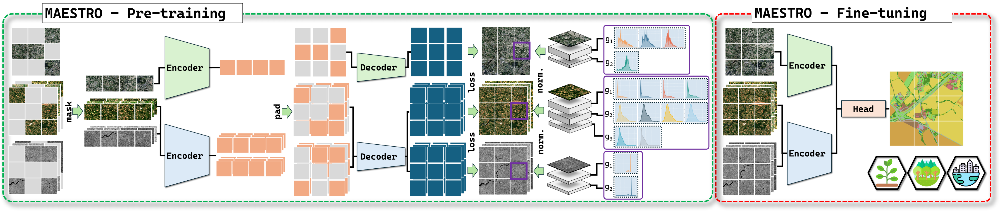
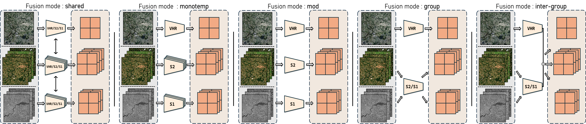

# MAESTRO: Masked Autoencoders for Multimodal, Multitemporal, and Multispectral Earth Observation Data

## Abstract
We introduce **MAESTRO**, a tailored adaptation of the Masked Autoencoder (MAE) framework that effectively orchestrates the use of multimodal, multitemporal, and multispectral Earth Observation (EO) data. Evaluated on four EO datasets, MAESTRO sets a new state-of-the-art on tasks that strongly rely on multitemporal dynamics, while remaining highly competitive on others.

<p align="center">
  <br>
  <em>Figure 1 — MAESTRO overview.</em>
</p>

## Contributions

- **Extensive Benchmarking of Multimodal/Multitemporal SSL:** Impact evaluation of various fusion strategies for multimodal and multitemporal SSL.
- **Novel Patch-group-wise Normalization:** Novel normalization scheme that normalizes reconstruction targets patch-wise within groups of highly correlated spectral bands.
- **MAESTRO:** Novel adaptation of the MAE that combines optimized fusion strategies with our tailored patch-group-wise normalization.

<p align="center">
  <br>
  <em>Figure 2 — Token-based fusion modes benchmarked for multimodal and multitemporal SSL.</em>
</p>

## Results

<p align="center">
  <em>
    Table 1 — Performance comparison of MAESTRO, baseline FMs, and supervised ViTs.<br>
    We report weighted F1 score (%) on TreeSatAI-TS and mIoU (%) on PASTIS-HD, FLAIR#2, and FLAIR-HUB.<br>
    MAESTRO† models were pre-trained for twice the number of epochs.
  </em>

| Model              | Size  | Fusion mode   | TreeSatAI-TS   | PASTIS-HD      | FLAIR#2         | FLAIR-HUB      |
|--------------------|-------|---------------|----------------|----------------|-----------------|----------------|
| **MAESTRO (ours)** |       |               |                |                |                 |                |
| MAESTRO            | Base  | group         | 78.5           | 68.8           | 63.8            | 64.9           |
| MAESTRO            | Base  | inter-group   | 78.8           | 68.6           | 62.6            | **65.9** 🔴↓**0.1**|
| MAESTRO†           | Base  | group         | 79.1           | 68.8           | **64.0** 🔴↓**0.2** | 64.8           |
| MAESTRO†           | Base  | inter-group   | **79.4** 🟢↑**2.7**| **69.0** 🟢↑**2.5**| 63.3            | 65.8           |
| **Baseline FMs**   |       |               |                |                |                 |                |
| DINO-v2            | Base  | shared        | **76.7**       | 64.4           | **64.2**        | **66.0**       |
| DINO-v2 sat.       | Large | shared        | 76.3           | 64.0           | 63.5            | **66.0**       |
| DOFA               | Base  | shared        | 76.0           | 62.9           | 62.3            | 65.1           |
| CROMA              | Base  | inter-croma   | 70.5           | 65.0           | 39.0            | 44.3           |
| AnySat             | Base  | --            | 75.1           | **66.5**       | 55.1            | --             |
| **Supervised ViTs**|       |               |                |                |                 |                |
| ViT                | Base  | group         | **75.7**       | **64.6**       | **58.3**        | 61.6           |
| ViT                | Base  | inter-group   | 75.6           | 64.5           | 58.2            | **62.1**       |
| **Previous SOTA**  |       |               | 75.1           | 66.5           | 64.1            | 64.3           |

</p>


## Getting Started
```bash
# 1. Change directory
cd MAESTRO

# 2. Install dependencies with Poetry
poetry install
```

### Run Locally
To run the code locally, you can use the following minimal example:
```bash
poetry run python main.py \
        model.model=mae \
        model.model_size=medium \
        model.use_ema=True \
        run.exp_name=mae-m_pastis \
        run.exp_dir=/path/to/experiments/dir \
        datasets.root_dir=/path/to/dataset/dir \
        datasets.pastis_hd.rel_dir=PASTIS-HD \
        datasets.filter_pretrain=[pastis_hd] \
        datasets.filter_finetune=[pastis_hd]

```
Hyperparameters can be adapted through the hydra configuration.

### Datasets
Our implementation already supports 4 datasets:  

**TreeSatAI-TS**  
Tree species identification, with 15 multi-label classes.
  - Extent: 50 381 tiles of 60 × 60 m in Germany.
  - Modalities: aerial imagery RGB + NIR (0.2 m), Sentinel-1 time series, Sentinel-2 time series.

**PASTIS-HD**  
Agricultural crop segmentation, with 19 semantic classes. 
  - Extent: 433 tiles of 1280 × 1280 m in France.
  - Modalities: VHR satellite imagery SPOT 6-7 (1 m), Sentinel-1 time series, Sentinel-2 time series.

**FLAIR#2**  
Land cover segmentation, with 12 semantic classes.
  - Extent: 77 762 tiles of 102.4 × 102.4 m in France.
  - Modalities: Aerial and elevation imagery RGB + NIR + DEM + DSM (0.2 m), Sentinel-2 time series.

**FLAIR-HUB**  
Land cover segmentation, with 15 semantic classes.
  - Extent: 241 100 tiles of 102.4 × 102.4 m in France.
  - Modalities: Aerial and elevation imagery RGB + NIR + DEM +
DSM (0.2 m), Sentinel-1 time series, Sentinel-2 time series.


## Contact

For questions or contributions, please open an issue or contact the authors.
 